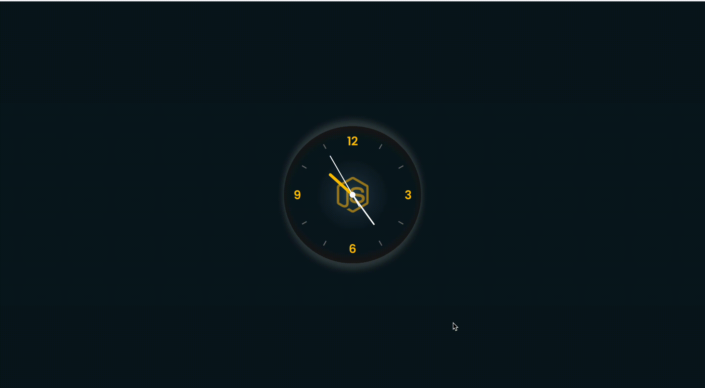

# API-time :clock10:

### Мини-приложение, показывающее точное время в любой точки мира в зависимости от API, которое вы передадите.
---
Проект часов принадлежит [Анискович Антон](https://antonaniskovich.ru/).

Разработчик:  [Ирина Папахина](https://github.com/PapakhinaIrina) 
___
